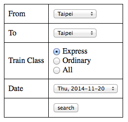

tairail
=======

Script which let's you more easily query Taiwan Railways Timetables (e.g. like you're used to from Switzerland where you just enter departure and destination)

Here is the search interface on the official homepage of Taiwan Railways:

http://twtraffic.tra.gov.tw/twrail/English/e_index.aspx

The biggest hassle is that you have to indicate the area/region of the departure and destination stations before you can select the cities itself. As a foreigner and tourist, you lack the knowledge of those associations.

Therefore, my script will generate a form including the biggest Taiwanese cities (the ones me and my fiancé have travelled to in December 2012) and help you retrieve timetables for a specific date and train type within seconds instead of minutes:

